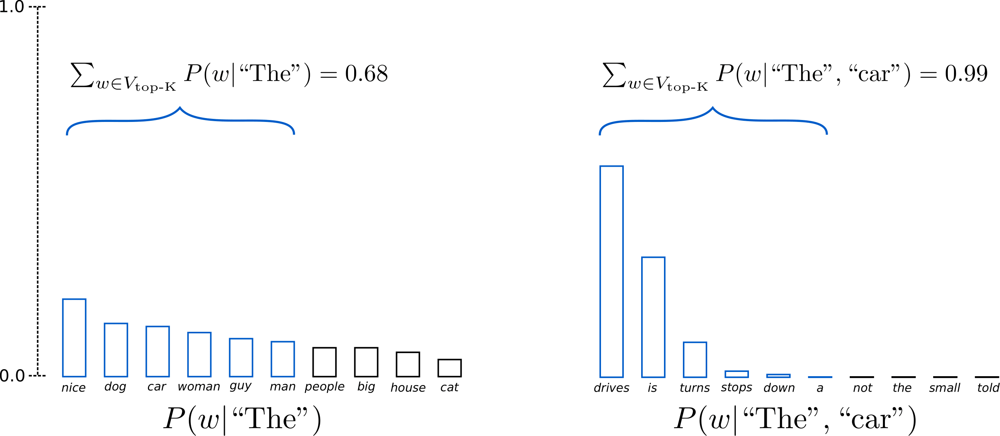

# NLP Research Notebooks

This repo all about text generation and NLP research notebooks and related text data manipulation techniques.


**Top K-sampling**

[Fan et. al (2018)](https://arxiv.org/pdf/1805.04833.pdf) introduced a simple, but very powerful sampling scheme, called ***Top-K\*** sampling. In *Top-K* sampling, the *K* most likely next words are filtered and the probability mass is redistributed among only those *K* next words. GPT2 adopted this sampling scheme, which was one of the reasons for its success in story generation.

[huggingface](https://github.com/huggingface/transformers) extend the range of words used for both sampling steps in the example above from 3 words to 10 words to better illustrate *Top-K* sampling.





### Text Generation playgrounds

- [OpenAI playground (GPT-3)](https://beta.openai.com/playground)
- [Playgrounds.AI (gpt2-small, medium, large, 2XL, Neo-125M, Neo-1.3B, Neo-2.7B) ](https://playgrounds.ai/) 
- [Huggingface (gpt)](https://transformer.huggingface.co/doc/gpt)
- [Huggingface (gpt-small, medium, large)](https://transformer.huggingface.co/doc/gpt2-large)


##### Starter References

- https://datajenius.com/
- https://lambdalabs.com/blog/demystifying-gpt-3
- https://github.com/elyase/awesome-gpt3
- https://nlpcloud.com/effectively-using-gpt-j-gpt-neo-gpt-3-alternatives-few-shot-learning.html


#### How to use research Env

```shell
docker build . -t txt_research

docker run -it --rm --gpus  txt_research

```


##### SSH compute host connect

##### generate RSA public key

```
ssh-keygen -t rsa -f tharhtetsan -C tharhtet1234@gmail.com
```

##### connect ssh to remote server

```
ssh -i tharhtetsan tharhtet1234@34.171.245.255
```

##### add config in VS code

```
Host 34.171.245.255
  HostName 34.171.245.2
  User tharhtet.3
  IdentityFile C:\Users\tharh\tharhtet3\tharhtetsan
```

##### Monitor GPU

```
nvidia-smi -l 1
```


